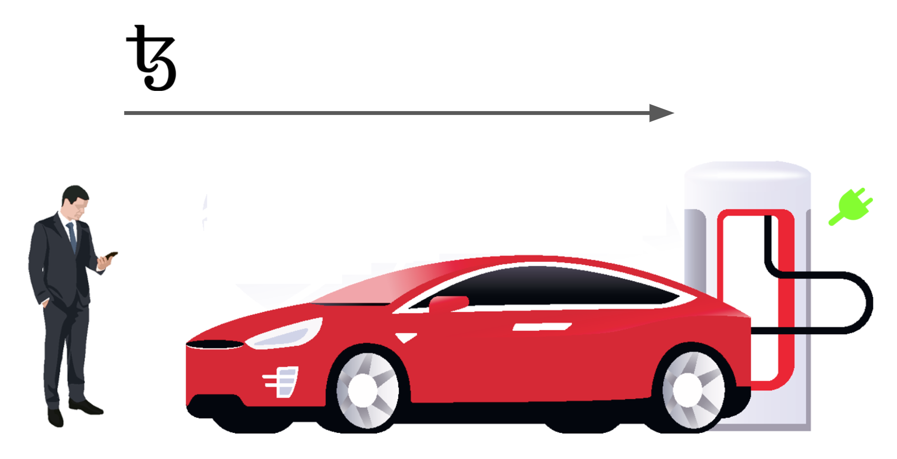

# Switch

How to control a connected object with a smart contract? 

1. write the on/off state of the object in the smart contract
2. make the connected object repeatedly read its state from the smart contract

Indeed the object must be able to actively read the contract storage on a regular basis because the blockchain is passive by nature.

Werenode is a french startup that wishes to leverage the power of the Tezos blockchain in order to simplify and reduce the cost of the electric vehicle charging process. They are currently developing a Tezos-based solution to pay and switch on the electric vehicle supply equipment \(EVSE\). 



The basic idea is to deploy a smart contract that pilots the state of the EVSE:



The smart contract should provide an entry point `start` which sets the status on. Of course, this should be done if the sufficient amount of tezis is transferred to the contract for the EVSE owner to buy the electricity and pay the maintenance of the equipment.

Rather than a boolean state, the state should be materialized as a date: if this date is in the future the object is on; it is off otherwise.

Basically the start entry converts the transferred tezis to a duration \(according to a rate\) and the duration to a date in the future.

Say for example the rate is 1.2, meaning the EVSE is switched on for 1h12m for each tezis transferred.

The following code implements this switch:

```javascript
archetype switch

variable owner : address = @tz1XZ7s6uStC2hZVpPQhXgcdXPwxifByF3Ao

variable interruption : date = 2020-06-18

variable rate : rational = 1.2 // in time_unit / tez_unit

variable time_unit : duration = 1h
variable tez_unit : tez = 1tz

variable user : address option = none

variable read_interval : duration = 5s

// UTILS
function get_rate_in_s_by_utz () : rational {
    var d : int = time_unit;
    var t : int = tez_unit;
    return (rate * d / t)
}

function get_return_tz () : tez {
    var res : int = 1 / get_rate_in_s_by_utz() * (interruption - now);
    return (res * 1utz)
}

// ENTRIES
entry start () {
    require {
        r1: now > interruption;
    }
    effect {
        var t : int = transferred;
        var dur : duration = (get_rate_in_s_by_utz() * t)*1s;
        if dur > read_interval then (
            interruption := now + dur + read_interval;
            user := some(caller)
        )
    }
}

entry interrupt () {
    require {
        r2: caller = getopt(user) and now < interruption
    }
    effect {
        transfer (get_return_tz()) to caller;
        interruption := now - read_interval;
    }
}

entry collect () {
    called by owner
    effect {
        var keep = 0tz;
        if now < interruption then
            keep := get_return_tz();
        if balance - keep > 0tz then
            transfer (balance - keep) to owner
    }
}

entry setunits (dunit : duration, tunit : tez) {
    called by owner
    effect {
        time_unit := dunit;
        tez_unit := tunit;
    }
}
```

The contract is available on the carthage net to play with:




