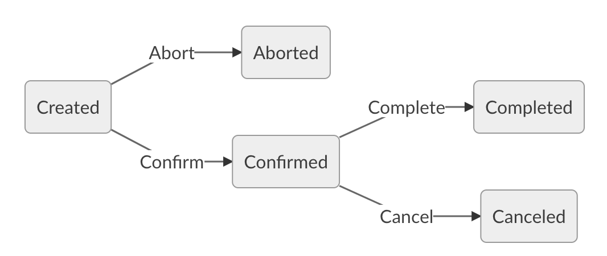

# Basic escrow

This first example is a toy contract which defines a very basic escrow process.

It is mainly a state machine with 5 states and 4 transitions according to the following schema:



Note that role values must be provided at declaration for security reason. 



```text
archetype escrow_simple

variable buyer role  = @tz1KmuhR6P52hw6xs5P69BXJYAURaznhvN1k

variable seller role = @tz1XJYAURaznhvN1khR6P52hw6xs5P691Kmu

variable oracle role = @tz15P69BXJYAURaznhvN1k1KmuhR6P52hw6x

variable price tez from buyer to seller = 10tz

(* action deadline *)
variable deadline date = 2019-06-01T00:00:00

(* state machine *)
states =
 | Created initial
 | Aborted
 | Confirmed
 | Canceled
 | Completed

transition abort from Created = {
  called by buyer or seller

  to Aborted
}

transition confirm from Created = {
  to Confirmed when { balance = price }
}

transition complete from Confirmed = {
  called by oracle

  to Completed when { now < deadline }
  with effect {
    transfer price
  }
}

transition cancel from Confirmed = {
  called by oracle

  to Canceled
  with effect {
    transfer back price
  }
}
```



